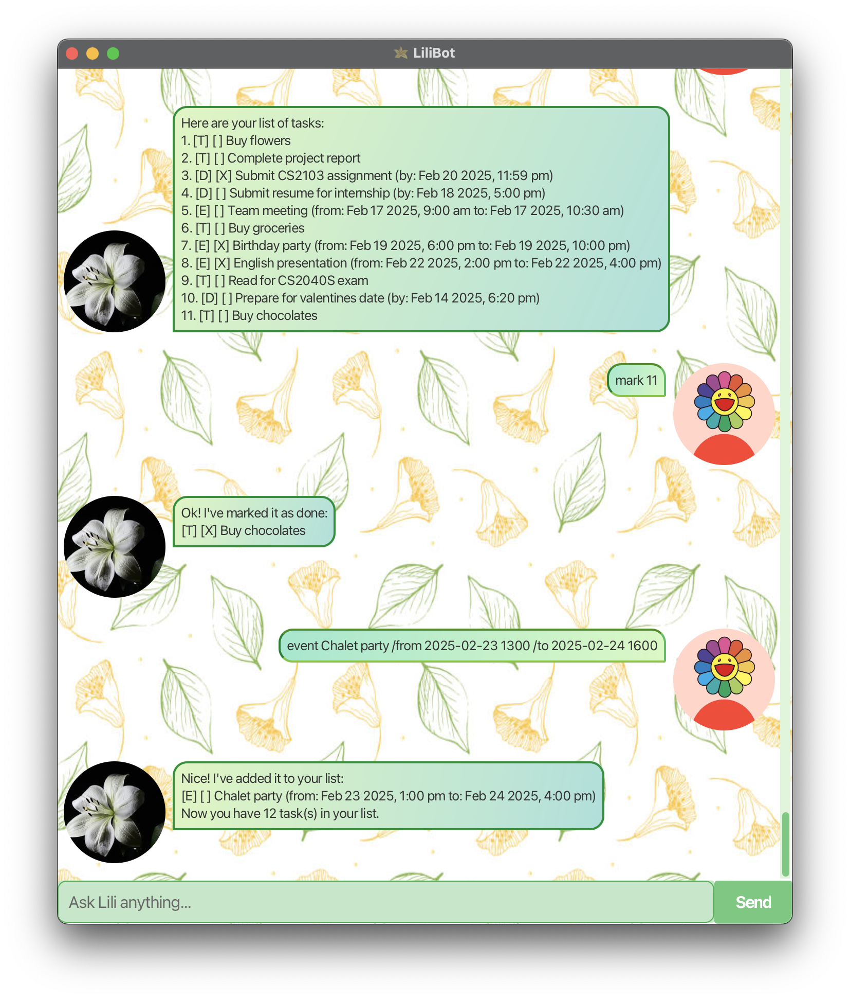

# LiliBot

## 🚀 Overview

**LiliBot** is a desktop chatbot application designed to help users manage their tasks, deadlines, and events with ease. Built as part of the CS2103 Software Engineering module, it offers a conversational and intuitive interface to streamline task management.

### 👥 Target Users

LiliBot is especially helpful for **students**, **busy professionals**, or anyone looking for a smart and interactive assistant to help stay on top of their to-do list.

### 😎 Value Proposition
Juggling multiple deadlines and responsibilities can be overwhelming. Manual tracking methods are often tedious and error-prone. LiliBot offers a solution by:
- Tracking tasks and deadlines through simple text commands
- Offering a responsive chatbot experience
- Supporting marking, deleting, and listing of tasks
- Enhancing productivity through a clean and distraction-free UI

## ✨ Features
- **Task Management**: Add, delete, and view your tasks easily
- **Deadlines & Events**: Stay on top of upcoming deadlines and scheduled events
- **Mark as Done**: Keep track of completed tasks
- **Conversational Interface**: Interact naturally with LiliBot via typed commands
- **Simple Setup**: Easy to install and run

# 💻 Getting Started

To set up LiliBot on your system:
1. Ensure you have Java 17 installed 
2. Clone or download the latest release from [GitHub](https://github.com/FabianHeng/ip/releases)
3. Run `java -jar lilibot.jar`

## Setting up in Intellij

Prerequisites: JDK 17, update Intellij to the most recent version.

1. Open Intellij (if you are not in the welcome screen, click `File` > `Close Project` to close the existing project first)
2. Open the project into Intellij as follows:
   - Click `Open`.
   - Select the project directory, and click `OK`.
   - If there are any further prompts, accept the defaults.
3. Configure the project to use **JDK 17** (not other versions) as explained in [here](https://www.jetbrains.com/help/idea/sdk.html#set-up-jdk).  
In the same dialog, set the **Project language level** field to the `SDK default` option.
4. After that, enter the command `./gradlew run`.

**Warning:** Keep the `src\main\java` folder as the root folder for Java files (i.e., don't rename those folders or move Java files to another folder outside of this folder path), as this is the default location some tools (e.g., Gradle) expect to find Java files.
